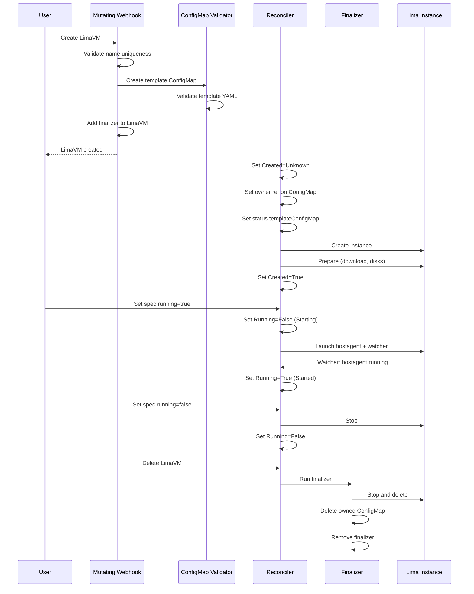
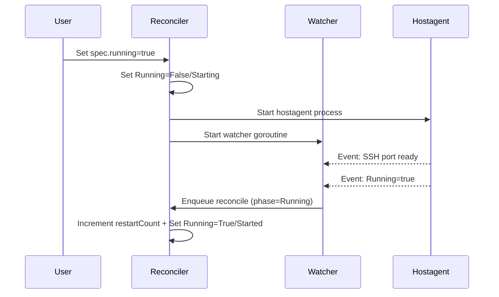
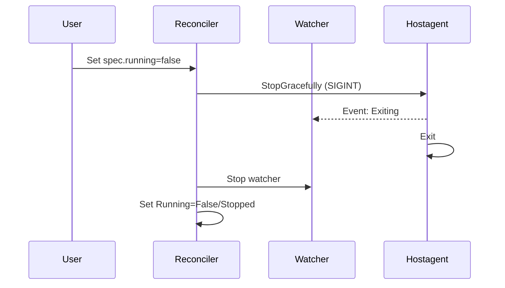
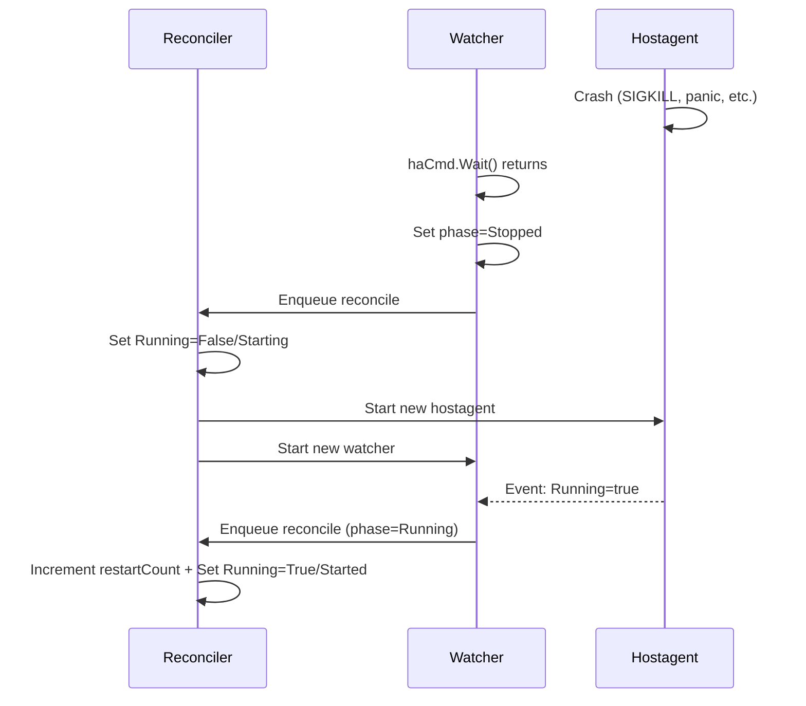
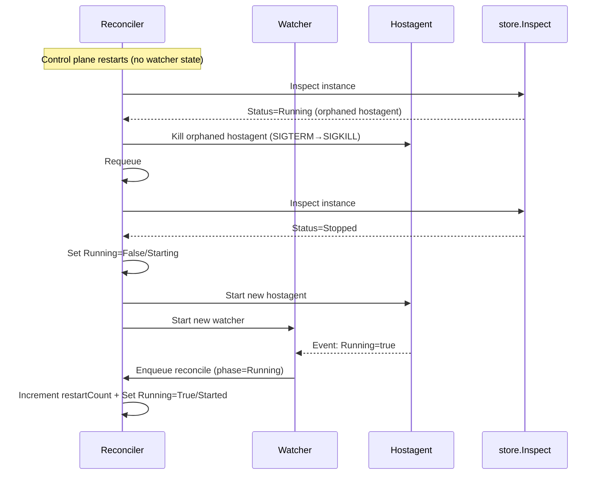
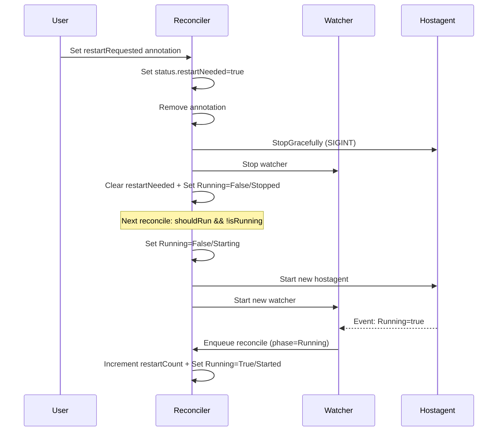
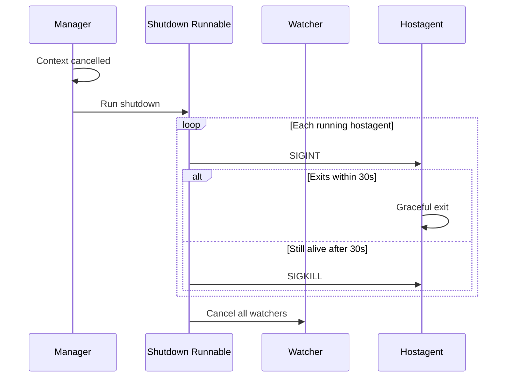

# Lima API

The `lima.rancherdesktop.io` API group includes resources managed by Lima, including `LimaVM`, `LimaDisk`, and `LimaNetwork`.

## LimaVM

A `LimaVM` resource represents a VM managed by this `rdd` instance.

`LimaVM` resources can be created in different namespaces, but the VM names must be unique across the whole `rdd` instance.

Grouping VMs in namespace is useful for creating snapshots of related VMs, and for managing the lifecycle to stop or delete all VMs inside a namespace.

### Example `LimaVM` object

```yaml
apiVersion: lima.rancherdesktop.io/v1alpha1
kind: LimaVM
metadata:
  name: alpine
  namespace: default
  annotations:
    lima.rancherdesktop.io/resetRequested: "2025-10-12T08:00:00Z"
    lima.rancherdesktop.io/restartRequested: "2025-10-12T10:30:00Z"
spec:
  running: true
  templateRef:
    name: alpine
    namespace: lima-templates
  params:
    DOCKER_ROOTFUL: "true"
status:
  templateConfigMap: alpine-template
  observedTemplateResourceVersion: "12345"
  restartNeeded: false
  restartCount: 3
  conditions:
  - type: Created
    status: "True"
    reason: Created
    message: Lima instance created successfully
  - type: Running
    status: "True"
    reason: Started
    message: Lima instance started successfully
```

- **metadata.annotations**: Request actions from the reconciler. All annotations use the `lima.rancherdesktop.io/` prefix.

    | Annotation | Description |
    |------------|-------------|
    | `restartRequested` | Triggers a restart. The reconciler translates the annotation to `status.restartNeeded` and removes it. Set to any value (e.g., a timestamp). |
    | `resetRequested` | Triggers a reset: delete the instance and recreate it with the same template and params. Set to any value. |

- **spec.running**: Set to `true` when the instance should be running, set to `false` when it should be stopped.

- **spec.templateRef**: Specifies the `lima.yaml` template for the machine. The template must pass Lima validation or the `LimaVM` creation will fail. 

    Initially the only way to specify a template is via a ConfigMap that will store the "fully embedded" template under the `template` key. It cannot reference external base templates or scripts. This will change eventually when `spec.templateRef.name` can also be set to a URL. The default for `spec.templateRef.namespace` is the same as `metadata.namespace`.

    The `LimaVM` controller will create a new ConfigMap (in `metadata.namespace`) with the `metadata.name` and a `"-template"` suffix to store a copy of the validated template. This name is stored under `status.templateConfigMap`. The original `spec.templateRef` source is never accessed again after this, and can be modified or deleted without affecting the `LimaVM` resource. The `spec.templateRef` is immutable after creation and only serves as documentation.

    The `status.templateConfigMap` can be modified, but must pass Lima validation for the update to succeed. If `spec.running` is `true` and the template has changed, then the instance will be restarted. The `status.templateConfigMap` cannot be deleted, except by deleting the `LimaVM` resource itself, which will clean up owned resources automatically.

- **spec.params**: Override `spec.params` settings in the template. These values will be merged with the template before validation, and when creating/updating the `lima.yaml` file of the actual instance on disk.

    If the template provisioning scripts are properly parameterized, then the instance settings can be modified by just updating `spec.params`, which is simpler than modifying the `template` inside the ConfigMap. If `spec.running` is `true` then changing `spec.params` will restart the instance.

- **status.templateConfigMap**: Name of the ConfigMap containing the validated template. The reconciler creates this ConfigMap after copying and validating the template from `spec.templateRef`. This ConfigMap is owned by the LimaVM and deleted automatically when the LimaVM is deleted.

- **status.observedTemplateResourceVersion**: Tracks the `resourceVersion` of the template ConfigMap last applied to the instance. When this differs from the ConfigMap's current `resourceVersion`, the reconciler compares the on-disk template with the ConfigMap data. If they differ, it writes the new template and restarts the instance (if running). For running instances, the version update is deferred until the restart completes, so observers can wait on this field to confirm that a template change has been fully applied. If the template data is identical (e.g. a label-only ConfigMap update), it records the new version without restarting.

- **status.restartNeeded**: Indicates a restart has been requested but not yet executed. The reconciler sets this field when it processes a `restartRequested` annotation or detects a template change on a running instance. The reconciler clears the flag when stopping the instance (before the restart begins), not after the restart completes. When the instance is already stopped, the reconciler clears the flag immediately. When the instance is starting, the reconciler waits for boot to finish before stopping.

- **status.restartCount**: Tracks how many times the instance has reached the Running state. The reconciler increments this counter each time it sets `Running=True/Started`. Because the next value is predictable, callers can use `kubectl wait --for=jsonpath` to block until a restart completes — something `lastTransitionTime` cannot support since `kubectl wait` matches exact values, not comparisons.

- **status.conditions**: Standard Kubernetes conditions tracking the LimaVM state.

    | Type      | Status    | Reason         | Description                                                  |
    |-----------|-----------|----------------|--------------------------------------------------------------|
    | `Created` | `Unknown` | `Pending`      | Reconciler has seen the resource; creation not yet attempted |
    | `Created` | `True`    | `Created`      | Lima instance exists on disk and is ready                    |
    | `Created` | `False`   | `CreateFailed` | Instance creation or preparation failed                      |
    | `Running` | `False`   | `Starting`     | Hostagent launched, VM booting                               |
    | `Running` | `True`    | `Started`      | Lima instance is running                                     |
    | `Running` | `False`   | `Stopped`      | Lima instance is stopped                                     |
    | `Running` | `False`   | `StartFailed`  | Lima instance failed to start                                |
    | `Running` | `False`   | `StopFailed`   | Lima instance failed to stop cleanly                         |

    ```mermaid
    stateDiagram-v2
      [*] --> Created=Unknown/Pending: Resource created
      Created=Unknown/Pending --> Created=True/Created: Lima instance created
      Created=Unknown/Pending --> Created=False/CreateFailed: Creation failed
      Created=True/Created --> Running=False/Starting: Hostagent launched
      Running=False/Starting --> Running=True/Started: VM running
      Running=False/Starting --> Running=False/StartFailed: Start failed
      Running=True/Started --> Running=False/Stopped: VM stopped
      Running=True/Started --> Running=False/StopFailed: Stop failed
    ```

    The App reconciler forwards each `Running` reason ending in `Failed`, with its `message`, to the App's `Settled` condition (see [App API](api_app.md)). Name new failure reasons so App consumers can read them directly.

Deleting a `LimaVM` object triggers the finalizer to force-stop the running instance, delete the Lima instance from disk, and remove the template ConfigMap. Users who want a graceful shutdown should stop the instance before deleting it.

#### Future: Grace Period Support

Similar to pod deletion, `LimaVM` deletion could honor `metadata.deletionGracePeriodSeconds`:

1. `rdd ctl delete limavm foo --grace-period=30` sets the grace period on the resource
2. The reconciler starts a graceful shutdown (similar to SIGTERM for containers)
3. After the grace period expires, the reconciler forces shutdown (similar to SIGKILL)
4. `--grace-period=0` would skip graceful shutdown entirely

A similar mechanism should apply to stopping instances via `spec.running = false`. An annotation like `lima.rancherdesktop.io/stopGracePeriod` could control how long to wait before forcing the stop.

The `rdd limavm` commands would support:
- `rdd limavm stop foo --force` - skip graceful shutdown (equivalent to `--grace-period=0`)
- `rdd limavm delete foo --force` - skip graceful shutdown before deletion
- `rdd limavm stop foo --grace-period=30` - wait up to 30 seconds before forcing
- `rdd limavm delete foo --grace-period=30` - wait up to 30 seconds before forcing deletion

Currently, the reconciler force-stops the instance on deletion. Graceful shutdown on delete could be added via the grace period mechanism described above.

### LimaVM Component Interactions



| Component | Responsibility | Hands off to |
|-----------|---------------|--------------|
| **Mutating Webhook** | Creates template ConfigMap, adds finalizer, validates name uniqueness | ConfigMap Validator |
| **ConfigMap Validator** | Validates template YAML, blocks deletion of in-use templates | Reconciler |
| **Reconciler** | Sets owner reference, creates Lima instance, manages running state | Finalizer (on deletion) |
| **Finalizer** | Stops and deletes Lima instance, cleans up owned resources | — |

The mutating webhook creates the ConfigMap during admission, but cannot set an owner reference because Kubernetes has not yet assigned the LimaVM a UID. The reconciler sets the owner reference on its first run. This two-phase setup enables the finalizer to discover and clean up owned resources automatically.

A `.preparing` sentinel file marks preparation in progress. If a reconcile fails after creating the instance but before updating the status, the next reconcile detects the sentinel and cleans up the incomplete instance.

A watcher goroutine monitors each hostagent process. If the hostagent crashes, the watcher detects the exit and triggers a reconcile, which restarts the instance. If the control plane itself crashes, the reconciler detects orphaned hostagents (running without a watcher) on restart, sends SIGTERM to allow a graceful shutdown, falls back to SIGKILL after 30 seconds, and starts fresh. See [Running State Lifecycle](#running-state-lifecycle) for details.

### Running State Lifecycle

The reconciler manages the hostagent process for each `LimaVM`. A watcher goroutine monitors the hostagent and triggers reconciles on state changes. The reconciler reads the watcher's in-memory phase and writes Kubernetes conditions — the watcher never writes conditions directly.

#### Normal Start

The user sets `spec.running=true`. The reconciler launches a hostagent and starts a watcher goroutine that tails the hostagent's event stream.



#### Normal Stop

The user sets `spec.running=false`. The reconciler stops the hostagent gracefully (SIGINT with 30-second timeout) and cleans up the watcher.



#### Crash Recovery

The hostagent crashes (killed or exits unexpectedly). The watcher detects the process exit via `haCmd.Wait()` and triggers a reconcile. The reconciler restarts the instance.



#### Orphan Recovery (Control Plane Restart)

The control plane crashes. Hostagents survive (own process group). On restart, the reconciler has no watcher state. It detects orphaned hostagents via `store.Inspect()`, sends SIGTERM to allow a graceful shutdown (falling back to SIGKILL after 30 seconds), and starts fresh with a watcher.



#### Restart

The user (or CLI) sets the `restartRequested` annotation. The reconciler translates it to `status.restartNeeded` in two cycles (status first, then annotation removal), stops the instance, and lets the normal start logic bring it back up.



#### Graceful Shutdown

The control plane shuts down. Hostagents run in their own process groups so they survive the control plane's exit. This allows the shutdown runnable to send SIGINT and wait for each hostagent to flush data and exit cleanly. If a hostagent were killed with the service, it could lose unsaved state. The shutdown runnable sends SIGINT first; hostagents that do not exit within 30 seconds receive SIGKILL.



## LimaDisk

While a `LimaVM` object is specific to an OS, a `LimaDisk` object is just an `ext4` filesystem that can be copied between host operating systems. (Needs verification!)

## LimaNetwork

TBD

See [WSL2 Networking](networking.md) for how the opensuse distro gets network connectivity on Windows via a virtual L2 network over AF_VSOCK.
