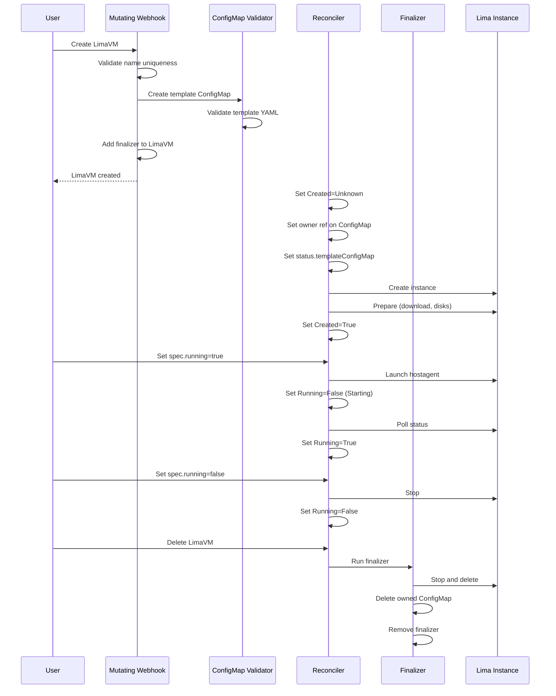

# Lima API

The `lima.rancherdesktop.io` API group includes resources managed by Lima, including `LimaVM`, `LimaDisk`, and `LimaNetwork`.

## LimaVM

A `LimaVM` resource represents a VM managed by this `rdd` instance.

`LimaVM` resources can be created in different namespaces, but the VM names must be unique across the whole `rdd` instance.

Grouping VMs in namespace is useful for creating snapshots of related VMs, and for managing the lifecycle to stop or delete all VMs inside a namespace.

### Example `LimaVM` object

```yaml
apiVersion: lima.rancherdesktop.io/v1alpha1
kind: LimaVM
metadata:
  name: alpine
  namespace: default
  annotations:
    lima.rancherdesktop.io/resetRequested: "2025-10-12T08:00:00Z"
    lima.rancherdesktop.io/restartRequested: "2025-10-12T10:30:00Z"
spec:
  running: true
  templateRef:
    name: alpine
    namespace: lima-templates
  params:
    DOCKER_ROOTFUL: "true"
status:
  templateConfigMap: alpine-template
  conditions:
  - type: Created
    status: "True"
    reason: Created
    message: Lima instance created successfully
  - type: Running
    status: "True"
    reason: Started
    message: Lima instance started successfully
```

- **metadata.annotations**: Can be used to request "actions" from the reconciler, like resetting (deleting and recreating with the same settings), or restarting the instance. The `status.conditions` can be used to store the state machine information.

- **spec.running**: Set to `true` when the instance should be running, set to `false` when it should be stopped.

- **spec.templateRef**: Specifies the `lima.yaml` template for the machine. The template must pass Lima validation or the `LimaVM` creation will fail. 

    Initially the only way to specify a template is via a ConfigMap that will store the "fully embedded" template under the `template` key. It cannot reference external base templates or scripts. This will change eventually when `spec.templateRef.name` can also be set to a URL. The default for `spec.templateRef.namespace` is the same as `metadata.namespace`.

    The `LimaVM` controller will create a new ConfigMap (in `metadata.namespace`) with the `metadata.name` and a `"-template"` suffix to store a copy of the validated template. This name is stored under `status.templateConfigMap`. The original `spec.templateRef` source is never accessed again after this, and can be modified or deleted without affecting the `LimaVM` resource. The `spec.templateRef` is immutable after creation and only serves as documentation.

    The `status.templateConfigMap` can be modified, but must pass Lima validation for the update to succeed. If `spec.running` is `true` and the template has changed, then the instance will be restarted. The `status.templateConfigMap` cannot be deleted, except by deleting the `LimaVM` resource itself, which will clean up owned resources automatically.

- **spec.params**: Override `spec.params` settings in the template. These values will be merged with the template before validation, and when creating/updating the `lima.yaml` file of the actual instance on disk.

    If the template provisioning scripts are properly parameterized, then the instance settings can be modified by just updating `spec.params`, which is simpler than modifying the `template` inside the ConfigMap. If `spec.running` is `true` then changing `spec.params` will restart the instance.

- **status.templateConfigMap**: Name of the ConfigMap containing the validated template. The reconciler creates this ConfigMap after copying and validating the template from `spec.templateRef`. This ConfigMap is owned by the LimaVM and deleted automatically when the LimaVM is deleted.

- **status.conditions**: Standard Kubernetes conditions tracking the LimaVM state.

    | Type      | Status    | Reason         | Description                                                  |
    |-----------|-----------|----------------|--------------------------------------------------------------|
    | `Created` | `Unknown` | `Pending`      | Reconciler has seen the resource; creation not yet attempted |
    | `Created` | `True`    | `Created`      | Lima instance exists on disk and is ready                    |
    | `Created` | `False`   | `CreateFailed` | Instance creation or preparation failed                      |
    | `Running` | `True`    | `Started`      | Lima instance is running                                     |
    | `Running` | `False`   | `Stopped`      | Lima instance is stopped                                     |
    | `Running` | `False`   | `StartFailed`  | Lima instance failed to start                                |
    | `Running` | `False`   | `StopFailed`   | Lima instance failed to stop cleanly                         |

Deleting a `LimaVM` object triggers the finalizer to stop the running instance, delete the Lima instance from disk, and remove the template ConfigMap.

#### Future: Grace Period Support

Similar to pod deletion, `LimaVM` deletion could honor `metadata.deletionGracePeriodSeconds`:

1. `rdd ctl delete limavm foo --grace-period=30` sets the grace period on the resource
2. The reconciler starts a graceful shutdown (similar to SIGTERM for containers)
3. After the grace period expires, the reconciler forces shutdown (similar to SIGKILL)
4. `--grace-period=0` would skip graceful shutdown entirely

A similar mechanism should apply to stopping instances via `spec.running = false`. An annotation like `lima.rancherdesktop.io/stopGracePeriod` could control how long to wait before forcing the stop.

The `rdd limavm` commands would support:
- `rdd limavm stop foo --force` - skip graceful shutdown (equivalent to `--grace-period=0`)
- `rdd limavm delete foo --force` - skip graceful shutdown before deletion
- `rdd limavm stop foo --grace-period=30` - wait up to 30 seconds before forcing
- `rdd limavm delete foo --grace-period=30` - wait up to 30 seconds before forcing deletion

Currently, the reconciler attempts graceful shutdown first, then falls back to forced shutdown if graceful shutdown fails or times out (~6 minutes, controlled by Lima).

### LimaVM Component Interactions



| Component | Responsibility | Hands off to |
|-----------|---------------|--------------|
| **Mutating Webhook** | Creates template ConfigMap, adds finalizer, validates name uniqueness | ConfigMap Validator |
| **ConfigMap Validator** | Validates template YAML, blocks deletion of in-use templates | Reconciler |
| **Reconciler** | Sets owner reference, creates Lima instance, manages running state | Finalizer (on deletion) |
| **Finalizer** | Stops and deletes Lima instance, cleans up owned resources | — |

The mutating webhook creates the ConfigMap during admission, but cannot set an owner reference because Kubernetes has not yet assigned the LimaVM a UID. The reconciler sets the owner reference on its first run. This two-phase setup enables the finalizer to discover and clean up owned resources automatically.

A `.preparing` sentinel file marks preparation in progress. If a reconcile fails after creating the instance but before updating the status, the next reconcile detects the sentinel and cleans up the incomplete instance.

If Lima reports the instance as "Broken" (e.g., hostagent crashed leaving stale PID files, or process mismatch between hostagent and VM driver), the reconciler attempts automatic recovery via force stop. If recovery succeeds, the instance returns to the Stopped state. If recovery fails, the `Running` condition is set to `False` with reason `Broken` and a message describing the error.

## LimaDisk

While a `LimaVM` object is specific to an OS, a `LimaDisk` object is just an `ext4` filesystem that can be copied between host operating systems. (Needs verification!)

## LimaNetwork

TBD
